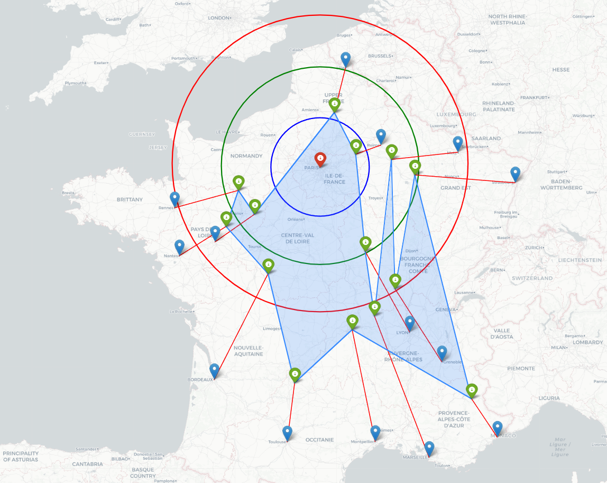
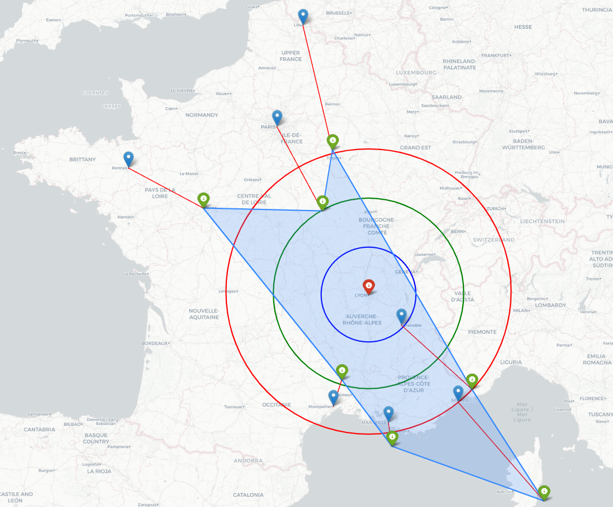

# Création d'une carte isochrone des gares de France

## Contexte du projet
Ce projet a été réalisé par moi-même (Arthur Gonay) et Rami Bougahami lors d'un hackathon organisé par l'entreprise Datalyo, interne à notre école Polytech Annecy-Chambéry. L'objectif était de réaliser des visualisations pertinentes à partir des données de la SNCF en seulement 8 heures.

## Introduction
Ce projet consiste à créer une carte isochrone des gares de France, en affichant les zones accessibles pour différents temps de trajet à partir d'une gare de référence. Les cercles bleus représentent les endroits accessibles pour 1 heure de trajet, les cercles verts pour 2 heures de trajet et les cercles rouges pour 3 heures de trajet. Les points bleus sont les emplacements des gares actuellement dans une ville et les points verts sont les emplacements des gares avec le décalage en fonction du temps que nous permet de visualiser la carte isochrone.

## Pré-requis
Avant de lancer le programme, assurez-vous que les bibliothèques Python suivantes sont installées :

- `requests`
- `pandas`
- `numpy`
- `geopandas`
- `matplotlib`
- `folium`
- `shapely`

```Shell
pip install requests pandas numpy geopandas matplotlib folium shapely
```

## Préparation des données

Les données utilisées dans cette analyse sont stockées dans un dataframe `df_regularite` contenant les informations suivantes :

- "Gare de départ" : la gare de départ du trajet
- "Gare d'arrivée" : la gare d'arrivée du trajet
- "Date" : la date du trajet
- "Durée moyenne du trajet" : la durée moyenne du trajet en minutes

Un dictionnaire `cities` a également été créé pour associer chaque ville à ses coordonnées géographiques.

## Calcul des temps de trajet

La fonction `haversine` a été utilisée pour calculer la distance géographique entre deux villes, en se basant sur leurs coordonnées géographiques. Cette distance a ensuite été utilisée pour estimer le temps de trajet moyen en utilisant les données de `df_regularite`.

## Réduction des vecteurs de trajet

La fonction `reduction_vect_trajet` a été créée pour réduire les vecteurs de trajet entre deux villes à une échelle donnée. Cette fonction prend en entrée l'échelle de réduction, ainsi que les noms des villes de départ et d'arrivée, et utilise les coordonnées géographiques de ces villes, ainsi que le temps de trajet moyen entre ces villes, pour calculer un vecteur de temps.

La fonction `generate_reducted_dico` a été utilisée pour créer un dictionnaire réduisant tous les vecteurs de trajet à une échelle donnée par rapport à une ville de référence donnée. Cette fonction prend en entrée l'échelle de réduction et le nom de la ville de référence, et utilise la fonction `reduction_vect_trajet` pour calculer les vecteurs de trajet réduits pour toutes les autres villes.

## Création d'une carte isochrone


Le code permet de créer une carte isochrone des gares de France. La carte est divisée en cercles concentriques, chacun représentant un temps de trajet maximal à partir d'un point de référence (une ville). Les cercles sont colorés en bleu, vert et rouge pour représenter les endroits accessibles respectivement en 1, 2 et 3 heures de trajet, et au-delà du cercle rouge, le temps de trajet est supérieur à 3 heures.

Les villes actuelles sont représentées par des points bleus sur la carte, tandis que les gares sont représentées par des points verts décalés en fonction du temps de trajet.

Le code effectue les étapes suivantes pour créer la carte :

1. Il récupère les coordonnées de chaque ville et de chaque gare à partir d'un fichier CSV.
2. Il calcule les distances de chaque gare à la ville de référence et les décale en fonction de leur temps de trajet, en utilisant une formule basée sur la vitesse moyenne des trains.
3. Il utilise la bibliothèque `shapely` pour créer une forme géométrique polygonale à partir des coordonnées des gares décalées. Cette forme géométrique représente l'ensemble des points accessibles en fonction du temps de trajet.
4. Il utilise la bibliothèque `geopandas` pour créer un objet géographique à partir de la forme géométrique polygonale, et enregistre cet objet dans un fichier `GeoJSON`, `GPKG` et `Shapefile`.
5. Il utilise la bibliothèque `folium` pour créer une carte interactive. Il ajoute des cercles bleu, vert et rouge pour représenter les endroits accessibles en fonction du temps de trajet, ainsi que des marqueurs pour chaque ville et chaque gare, et relie les villes et les gares par des lignes rouges.
6. Il affiche la carte interactive dans la console et enregistre la carte sous forme de fichier HTML.

En conclusion, le code calcule les temps de trajet entre les gares et les villes, puis crée une carte interactive qui représente graphiquement les zones accessibles en fonction du temps de trajet.
# Paris

# Lyon

